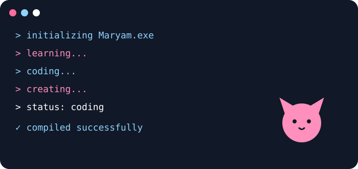
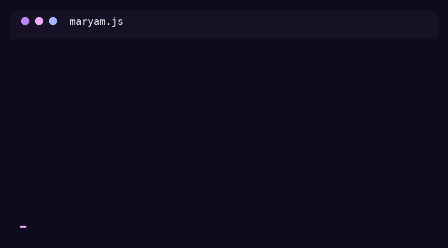

  

### Developer Tips

> - **Write clean code:** Always prioritize readability and maintainability.
> - **Comment effectively:** Explain the "why," not the "what," in your comments.
> - **Test your code:** Automated testing saves countless hours of debugging.
> - **Learn continuously:** The tech world evolves rapidly, so keep exploring new tools.
> - **Version control is key:** Commit often and write meaningful commit messages.

  <h1 style="font-family: monospace;">
    
  </h1>

  

  

